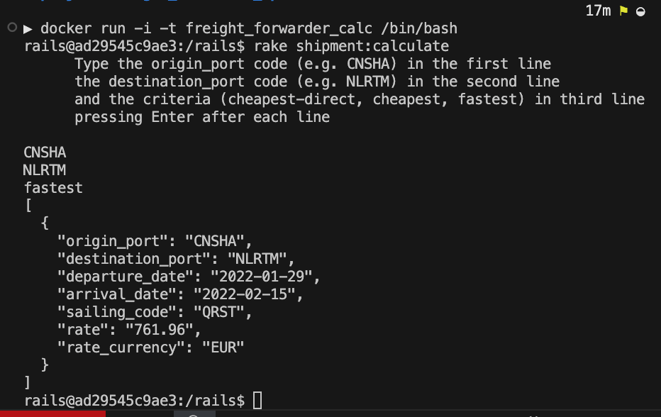

# Freight Forwarder Calculator

## Overview

Freight Forwarder Calculator is a web service designed to assist in calculating optimal shipment options between ports. It processes sailing schedules, rates, and exchange rates to provide users with the most cost-effective or fastest shipping routes based on their specified criteria. Users can determine the cheapest direct sailing, the cheapest route (including indirect sailings), or the fastest route between two ports.

## Key Features

- **Cheapest Direct Sailing**: Find the most affordable direct shipping option between two ports.
- **Cheapest Route**: Calculate the least expensive route between two ports, including indirect sailings.
- **Fastest Route**: Determine the quickest route based on the earliest possible arrival date.
- **Docker Support**: Containerized application for easy deployment and testing.
- **Command-Line Interface**: Run calculations directly from the command line using a rake task.
- **RESTful API**: Exposes endpoints for integration with other services or applications.
- **Swagger UI**: Interactive API documentation and testing interface.
- **Automated Testing**: Comprehensive test suite using RSpec.

## Technologies Utilized

- **Ruby**: Version 3.3.5
- **Rails**: Version 7.2.1
- **RSpec**: For unit and integration testing
- **Swagger**: For API documentation and testing
- **Docker**: For containerization
- **Fly.io**: For deployment
- **Rake**: For task automation

## Requirements (Development)

Ensure that the following versions are installed:

- **Ruby**: Version 3.3.5
- **Rails**: Version 7.2.1

Please refer to the specific versions in the `Gemfile.lock` to ensure compatibility during development.

## Local Development Setup

1. **Clone the Project**

   ```bash
   git clone git@github.com:bolah2009/freight-forwarder-calculator.git
   cd freight-forwarder-calculator
   ```

2. **Install Dependencies**

   ```bash
   bundle install
   ```

3. **Start the Server**

   ```bash
   rails server
   ```

4. **Access the Service**

   Open your browser and navigate to [http://localhost:3000](http://localhost:3000)

## Using the Application

There are three ways to use the Freight Forwarder Calculator:

### 1. Using the Command-Line Interface with Docker

You can run the application inside a Docker container and execute the rake task to perform calculations.

**Steps:**

1. **Build the Docker Image**

   ```bash
   docker build -t freight-forwarder-calc .
   ```

2. **Run the Docker Container**

   ```bash
   docker run -it freight-forwarder-calc /bin/bash
   ```

3. **Execute the Rake Task**

   Inside the Docker container, run:

   ```bash
   rake shipment:calculate
   ```

4. **Provide Input**

   Enter the following, pressing **Enter** after each line:

   ```
   CNSHA
   NLRTM
   fastest
   ```

5. **View the Output**

   The result will be displayed in JSON format as shown in the below screenshot.

   

### 2. Using cURL (After Local Setup or Deployed Link)

You can interact with the API using `curl` commands, either on your local setup or via the deployed service.

**Local Example:**

```bash
curl -X POST http://localhost:3000/api/v1/shipments \
  -H 'Content-Type: application/json' \
  -d '{
    "origin_port": "CNSHA",
    "destination_port": "NLRTM",
    "criteria": "cheapest-direct"
  }'
```

**Deployed Example:**

```bash
curl -X POST https://freight-forwarder-calculator.fly.dev/api/v1/shipments \
  -H 'Content-Type: application/json' \
  -d '{
    "origin_port": "CNSHA",
    "destination_port": "NLRTM",
    "criteria": "cheapest-direct"
  }'
```

**Output:**

```json
[
  {
    "origin_port": "CNSHA",
    "destination_port": "NLRTM",
    "departure_date": "2024-02-01",
    "arrival_date": "2024-03-01",
    "sailing_code": "XXXX",
    "rate": "123.00",
    "rate_currency": "USD"
  }
]
```

### 3. Using the Swagger UI

The Swagger UI provides an interactive interface to explore and test the API endpoints.

**Local Access:**

1. Ensure the Rails server is running.

2. Navigate to [http://localhost:3000/api-docs](http://localhost:3000/api-docs) in your browser.

**Deployed Access:**

Visit [https://freight-forwarder-calculator.fly.dev/api-docs](https://freight-forwarder-calculator.fly.dev/api-docs)

**Instructions:**

- Use the Swagger UI to select the `POST /api/v1/shipments` endpoint.
- Click on the "Try it out" button.
- Provide the required parameters:

  ```json
  {
    "origin_port": "CNSHA",
    "destination_port": "NLRTM",
    "criteria": "cheapest-direct"
  }
  ```

- Execute the request and view the response.

## Running Tests

To run automated tests, use:

```bash
rspec --force-color --format documentation
```

To run Rubocop for linting:

```bash
rubocop
```

To automatically fix linting issues:

```bash
rubocop -a
# or
rubocop -A
```

## Deployed Version

### Live Link

- [Web Service Live Link](https://freight-forwarder-calculator.fly.dev/)

## Resources Used

- [Shortest path problem](https://en.wikipedia.org/wiki/Shortest_path_problem)
- [Dijkstra's algorithm](https://en.wikipedia.org/wiki/Dijkstra%27s_algorithm)
- [Dijkstra's Shortest Path Algorithm - A Detailed and Visual Introduction](https://www.freecodecamp.org/news/dijkstras-shortest-path-algorithm-visual-introduction/)

## 👤 Author

- GitHub: [@bolah2009](https://github.com/bolah2009)
- Twitter: [@bolah2009](https://twitter.com/bolah2009)
- LinkedIn: [@bolah2009](https://www.linkedin.com/in/bolah2009/)

## 📝 License

[MIT licensed](./LICENSE).
